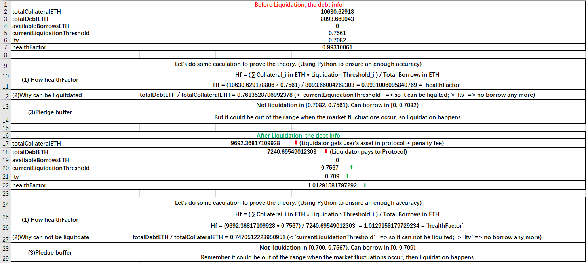
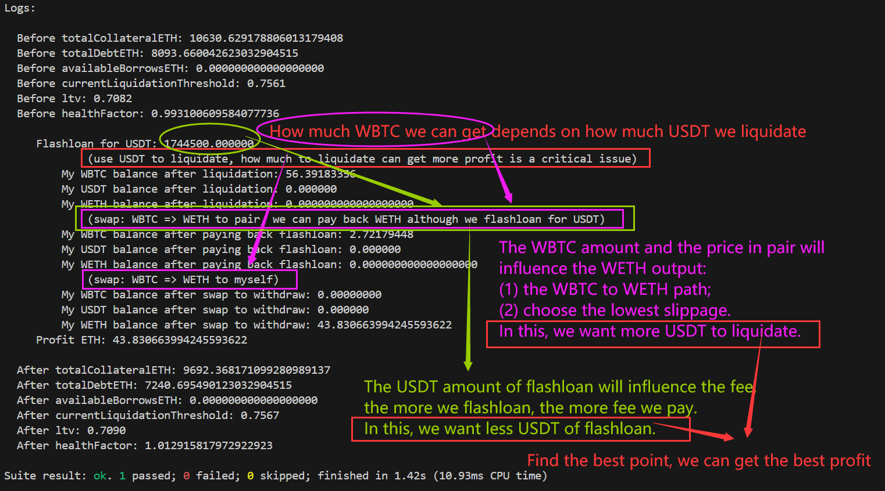

# Liquidation-Comparisons 

We have [Chinese Version](https://github.com/chen4903/Liquidation-Comparisons/blob/master/README_CN.md).

## Brief

We use Foundry to conduct practical demonstrations of liquidate various lending protocols, with the goal of achieving higher profits and explaining the liquidation strategies as clearly as possible.

## Protocols

| Protocols   | Liquidation functions |
| ----------- | --------------------- |
| AAVE_V2     | liquidationCall()     |
| Compound_V2 | ...                   |
| ...         | ...                   |

## Effect factors

How to maximize profits? The influencing factors generally include the following:

- healthFactor: It's not true that the closer it gets to 1, the greater the profit is.
- gas: If the profit you earn after liquidation can not cover gas, you would lose money.
- The amount of Liquidation: The max ratio of liquidation that can be made for each protocol varies. E.g. AAVEV2 is 50%. How much should we liquidation is an issue?
- Liquidation reward: Do you want underlying token or aToken?
- Slippage:
  - To swap the token that we get after liquidation to the token we want.
  - The best path to swap, making the slippage the lowest.
- User's debt specifications
  - Price: The price of the token that user borrows and collaterals.
  - Amount: The amount you can get after liquidation and the depth of the pool will influence the output of swap directly.
- Flashloan(If you liquidate by flashloan):
  - Flashloan fee.
  - The pool's depth limits the number you can flashloan.

## Math

> Assuming that all swaps are priced in WETH, all swaps will ultimately be converted to WETH

We define:

- a: The amount of flashloan.
- b: The fee of flashloan.
- c: gas.
- d: The amount of WETH after liquidation and swap we can get.
- P: The profit we earn ultimately.

We can infer:
$$
P = d - b -c \qquad [f(a) = d]
$$
`a` will indirectly affect `d`, and `a` represents your liquidation ability under the flashloan. Your liquidation strategy directly affect profits, and are influenced by a mixture of the seven effect factors mentioned above, so the logic behind this will not be simple and clear. Let's further calculate the `d`:

>  TODO

## Demo

> Usage: 
>
> 1.Clone the project: `git clone https://github.com/chen4903/Liquidation-Comparisons.git`.
>
> 2.Download dependences: `forge install`。Make sure your PC has the environment of [Foundry](https://book.getfoundry.sh/).
>
> 3.Test a file: `forge test --match-path test/eth/< FILE NAME > -vvv`.

### eth

#### AAVE_V2

##### tx1

We demonstrated this [Liquidation](https://etherscan.io/tx/0xac7df37a43fab1b130318bbb761861b8357650db2e2c6493b73d6da3d9581077),searching for the maximum liquidation profit situation, we get 43.830663994245593622 ETH. The details can be seen in `test/eth/AAVE_V2_tx1.sol`.

As the following pictures, we use excel to induce the debt and asset flow before and after liquidation. The source file is in `SourceMaterials/AAVE_V2_tx1.xlsx`(Windows 11 file).



I don't have a good liquidation strategy and technique. I just try different number to liquidate and test it again and again until finding a profit I can bear. What I interest are 2 stuff: 

- How much USDT should I flashloan to liquidate? The more I flashloan, the higher reward we can get after liquidation while the flashloan fee is higher.
- How to choose a nice path to swap? We should considerate the slippage.

I show my logic in the following picture:



I choose: 

- Flashloan for 1_744_500.000_000 USDT to liquidate. (Do not ask me how to get this number, I just keep the path unchanged and change the USDT amount again and again. I am a noob of liquidation, I think there must be a better strategy to liquidate.)
- Use`path=[WBTC=>WETH]` to pay back flashloan.
- Use `path=[WBTC=>WETH]` to swap and get WETH.

I discover 3 things finally:

- Not true that the healthFactor is close to 1, the profit is higher.
- No one can find the best strategy but only search for a better strategy.
- We don't considerate the gas in our test. If we add many logic and OPCODE in the strategy, the gas will cost more. So in the actual production environment, especially when the network is in jam, gas should be a critical effect factor.

##### tx1pro

这一次的清算比tx1更多，获得了个85.048539834763696741ETH。

This profit is more than tx1, we get 85.048539834763696741ETH.

We use a better strategy:

- Flashloan for USDC in sushiswap, and then swap USDC to USDT in Cureve, because we should use USDT to liquidate.
- Use sushiswap to swap[WBTC=>WETH]. Because if the `K` is bigger and our swap is smaller, the slippage is smaller. We calculate the K before swap for paying back flashloan, we find that: the WBTC price difference between uniswap and sushiswap is not particularly large, but the sushiswap's `K` is 5 times to uniswap. We can get more output in sushiswap than uniswap.

```python
uniswap_pool_wbtcweth_WBTC_price = 38844042475154482370337 / 229369102880
sushiswap_pool_wtbcweth_WBTC_price = 88902650478574486113986 / 525397180491
price_cap = uniswap_pool_wbtcweth_WBTC_price - sushiswap_pool_wtbcweth_WBTC_price
K_in_uniswap_wbtcweth=38844042475154482370337*229369102880
K_in_sushiswap_wbtcweth=88902650478574486113986*525397180491
times=K_in_sushiswap_wbtcweth/K_in_uniswap_wbtcweth # 5.2425563891353235
print("uniswap_pool_wbtcweth_WBTC_price", uniswap_pool_wbtcweth_WBTC_price)
print("sushiswap_pool_wtbcweth_WBTC_price", sushiswap_pool_wtbcweth_WBTC_price)
print("sushi K is ", times, "time to uniswap K")
```

This is the whole liquidation flow:

```
Before totalCollateralETH: 10630.629178806013179408
  Before totalDebtETH: 8093.660042623032904515
  Before availableBorrowsETH: 0.000000000000000000
  Before currentLiquidationThreshold: 0.7561
  Before ltv: 0.7082
  Before healthFactor: 0.993100609584077736

     Flashloan for USDC(USDC-WETH): 2919549.181195
             (Use USDC to liquidate, how much to liquidate can get more profit is a critical issue)
         My WBTC balance: 0.00000000
         My USDT balance: 0.000000
         My USDC balance: 2919549.181195
         My WETH balance: 0.000000000000000000
             (Swap[cureve, DAI_USDC_USDT]: USDC => USDT)
         My WBTC balance: 0.00000000
         My USDT balance: 2916358.033172
         My USDC balance: 0.000000
         My WETH balance: 0.000000000000000000
             (After liquidation)
         My WBTC balance: 94.27272961
         My USDT balance: 0.000000
         My USDC balance: 0.000000
         My WETH balance: 0.000000000000000000
  test reserves_WBTC: 525397180491
  test reserves_WETH: 88902650478574486113986
             (Swap[sushi_v2]: WBTC => WETH. Pay back flashloan + fee. We borrow USDC but pay back WETH)
         My WBTC balance: 5.21848953
         My USDT balance: 0.000000
         My USDC balance: 0.000000
         My WETH balance: 0.000000000000000000
             (Swap[sushi_v2]: WBTC => WETH. We want WETH)
         My WBTC balance: 0.00000000
         My USDT balance: 0.000000
         My USDC balance: 0.000000
         My WETH balance: 85.048539834763696741

     Profit ETH: 85.048539834763696741

  After totalCollateralETH: 9062.096632528174258397
  After totalDebtETH: 6667.721364093260419515
  After availableBorrowsETH: 0.000000000000000000
  After currentLiquidationThreshold: 0.7572
  After ltv: 0.7096
  After healthFactor: 1.029110125552384781
```

#### Compound_V2

### bsc


