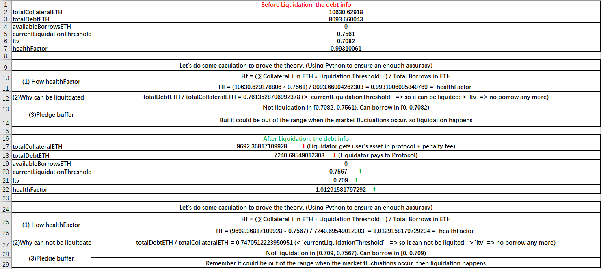
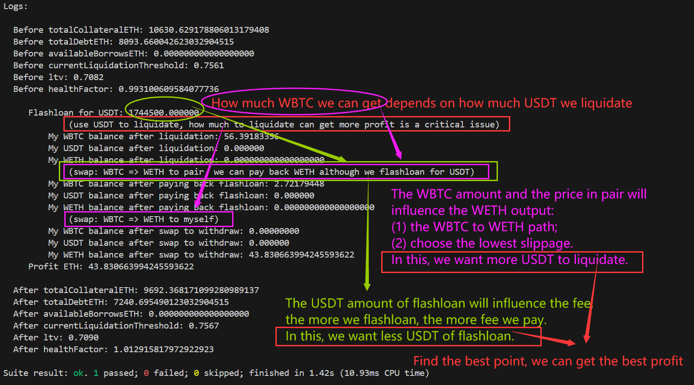

# Liquidation-Comparisons 

## 简介

我们使用foundry对各个借贷协议的清算做实战演示，并且以更高的获利为目标，并且尽可能地讲清楚其中的策略

## 各大协议

| 协议        | 清算函数          |
| ----------- | ----------------- |
| AAVE_V2     | liquidationCall() |
| Compound_V2 | ...               |
| ...         | ...               |

## 影响因素

如何使得获利最大呢？影响的因素大致有以下几点：

- 健康值：并不是越接近1获利就越大
- gas费用：如果获利无法覆盖gas费用，则清算亏本
- 清算数量：每个协议可清算的数量不同，AAVE是最多清算50%，我们应该清算多少才是合理的呢？
- 清算奖励：应该是获得underlying token还是aToken呢？
- swap滑点：
  - 将清算获得的代币转换为我们想要的代币
  - 选择最佳的swap路径，使得滑点最低
- 用户债务规模
  - 价格：得到了清算得到的代币之后，需要查询哪个池子的价格最高
  - 数量：清算得到的代币数量、池子的深度，直接影响了swap得到的产出
- 闪电贷借款（如果是使用闪电贷来清算）：
  - 手续费
  - 可借款的数量

## 数学原理

> 假设均以WETH计价，所有swap最终都转换为WETH
>

我们定义：

- a：闪电贷借款数量
- b：闪电贷手续费
- c：gas费用
- d：清算奖励经过swap之后得到的WETH数目
- P：最终获利

因此可以写成：
$$
P = d - b -c \qquad [f(a) = d]
$$
a会间接的影响d，a代表你的在闪电贷赋予下的清算能力。你的清算策略和市场情况直接影响获利，受到上述7个因素混合影响，因此这其中的逻辑不会简单明了。下面让我们来进一步计算清算d：

>  TODO

## demo演示

> 为了使用我们的测试，你应该这么做：
>
> 1.git clone项目：`git clone https://github.com/chen4903/Liquidation-Comparisons.git`
>
> 2.下载依赖：`forge install`。你必须保证你有foundry环境
>
> 3.测试某个文件：`forge test --match-path test/eth/< FILE NAME > -vvv`

### eth

#### AAVE_V2

我们演示了这个[清算](https://etherscan.io/tx/0xac7df37a43fab1b130318bbb761861b8357650db2e2c6493b73d6da3d9581077)，寻找最大的清算获利情况，我们获得了43.830663994245593622个ETH，详细步骤移步到`test/eth/AAVE_V2_tx1.sol`查看。

如下图，我们用Excel来具体的计算本次清算前后的情况，源文件见`SourceMaterials/AAVE_V2_tx1.xlsx`(Windows 11文件)查看。

对于我来说，找到一个合适的清算策略并没有技巧，我只是不断地尝试然后进行测试，找到我能够找到的最高获利。我寻找的方向有：

- 闪电贷借款多少USDT来清算呢？借款越多，手续费越高，但是清算得到的奖励越多
- 选择怎么样的path去swap能够获利最多呢？借款的USDT数量又会影响滑点

如下图：

我选择了：

- 闪电贷借款1744500000000数量的USDT进行清算（别问我如何得到的，我只是保持path不变，不断的修改这个数字尝试，我是一个新手，但我相信一定有某种模式可以得到更好的策略）
- 使用`path=[WBTC=>WETH]`的路径还款闪电贷（虽然借的是USDT，但是uniswap_V2只要维持K值即可通过检查）；
- 使用`path=[WBTC=>WETH]`的路径来得到我想要的ETH。

最后，我发现了：

- 并不是使得healthFactor越接近1，获利就一定越高
- 无法找到最佳的策略，我们只能不断的寻找更合适的策略
- 本处并没有考虑gas，如果你使用更多的策略来进行清算、swap等，消耗的gas将会更多。我们需要考虑他，因为我们的获利需要能够覆盖gas，在网络拥堵的时候，他更加值得考虑

#### Compound_V2

### bsc

