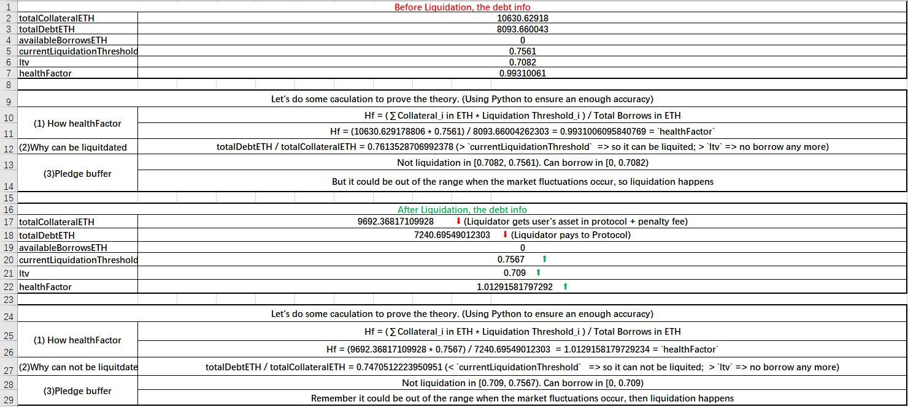
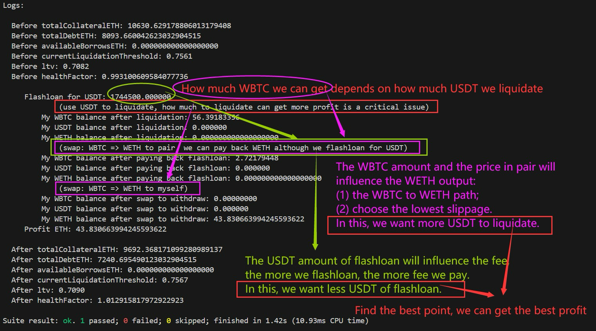

测试：`forge test --match-path test/eth/AAVE_V2_tx1.sol -vvv`

我们演示了这个[清算](https://etherscan.io/tx/0xac7df37a43fab1b130318bbb761861b8357650db2e2c6493b73d6da3d9581077)，寻找最大的清算获利情况，我们获得了43.830663994245593622个ETH，详细步骤移步到`test/eth/AAVE_V2_tx1.sol`查看。

如下图，我们用Excel来具体的计算本次清算前后的情况，源文件见`SourceMaterials/AAVE_V2_tx1.xlsx`查看。

对于我来说，找到一个合适的清算策略并没有技巧，我只是不断地尝试然后进行测试，找到我能够找到的最高获利。我寻找的方向有：

- 闪电贷借款多少USDT来清算呢？借款越多，手续费越高，但是清算得到的奖励越多
- 选择怎么样的path去swap能够获利最多呢？借款的USDT数量又会影响滑点

如下图：

我选择了：

- 闪电贷借款1744500000000数量的USDT进行清算（别问我如何得到的，我只是保持path不变，不断的修改这个数字尝试，我是一个新手，但我相信一定有某种模式可以得到更好的策略）
- 使用`path=[WBTC=>WETH]`的路径还款闪电贷（虽然借的是USDT，但是uniswap_V2只要维持K值即可通过检查）；
- 使用`path=[WBTC=>WETH]`的路径来得到我想要的ETH。

最后，我发现了：

- 并不是使得healthFactor越接近1，获利就一定越高
- 无法找到最佳的策略，我们只能不断的寻找更合适的策略
- 本处并没有考虑gas，如果你使用更多的策略来进行清算、swap等，消耗的gas将会更多。我们需要考虑他，因为我们的获利需要能够覆盖gas，在网络拥堵的时候，他更加值得考虑