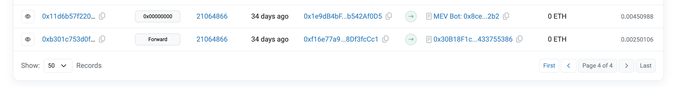
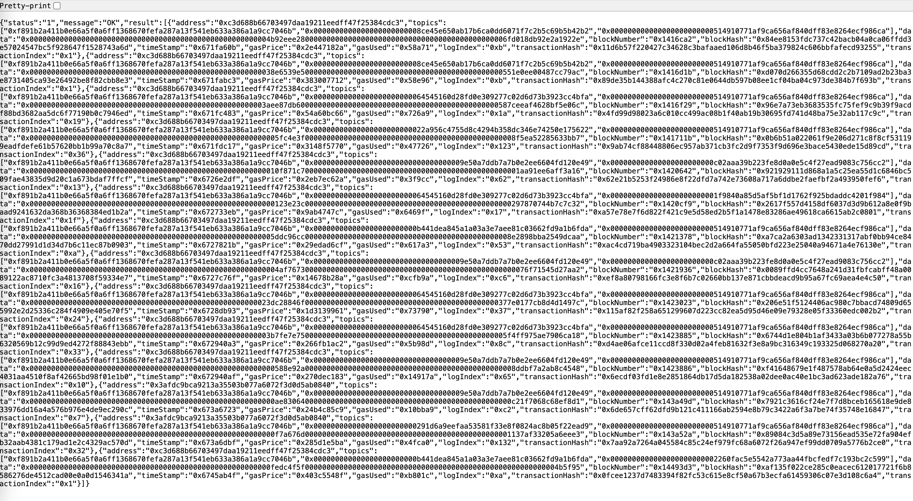

# Compound V3 Liquidation

它提供了非常方便的[接口](https://docs.compound.finance/liquidation/)供我们清算。我们主要需要用到这三个函数：

- 判断是否可以清算

```solidity
function isLiquidatable(address account) public view returns (bool)
```

- 设置清算人和被清算的用户

```solidity
function absorb(address absorber, address[] calldata accounts)
```

- 清算

```solidity
function buyCollateral(address asset, uint minAmount, uint baseAmount, address recipient) external
```

我们模仿的这个[清算](0x11d6b57f220427c34628c3bafaaed106d8b46f5ba379824c606bbfafecd93255)，也是后跑，跟在`Forward()`后面



清算的输出

```
  isLiquidatable: true
     usdc: 0.000000
     weth: 8.036936676600142848
     link: 0.000000000000000000
  swap: weth => usdc
     usdc: 20286.729768
     weth: 0.000000000000000000
     link: 0.000000000000000000
  start liquidate
     absorb()
     buyCollateral(): usdc => link
  end liquidate
     usdc: 0.000000
     weth: 0.000000000000000000
     link: 2062.583568565004243502
  swap: link => weth
     usdc: 0.000000
     weth: 8.933360618507175614
     link: 0.000000000000000000
  isLiquidatable: false
  weth profit: 0.896423941907032766
```

使用了两个swap和清算，最终获利0.896ETH（不包含gas费用）。而在实际的交易中，给了很多贿赂费给著名的Titan Builder。

所以，如果想要加入清算的MEV行列，应该考虑以下几个方面：

- 极致的智能合约代码，节省gas费用
- 贿赂Builder，和`Forward()`交易打包在一起上链（更准确的说是放在`Forward()`后面）
- 低延迟的本地节点，监控协议的用户的抵押情况和健康度
- 高效的swap路由方式，降低滑点

另外，这里提供一个快速找到清算交易的方式，以供练习：使用Etherscan的API，根据清算函数中特有的事件进行过滤。我们以Compound V3为例，`buyCollateral()`中有一个日志：

```bash
cast keccak "BuyCollateral(address,address,uint256,uint256)"
# 0xf891b2a411b0e66a5f0a6ff1368670fefa287a13f541eb633a386a1a9cc7046b
```

然后使用Etherscan：

```
https://api.etherscan.io/api?module=logs&action=getLogs&fromBlock=21005082&toBlock=21315082&topic0=0xf891b2a411b0e66a5f0a6ff1368670fefa287a13f541eb633a386a1a9cc7046b&page=1&offset=1000&apikey=????
```

Ok，我们得到了一大堆清算的实例：




